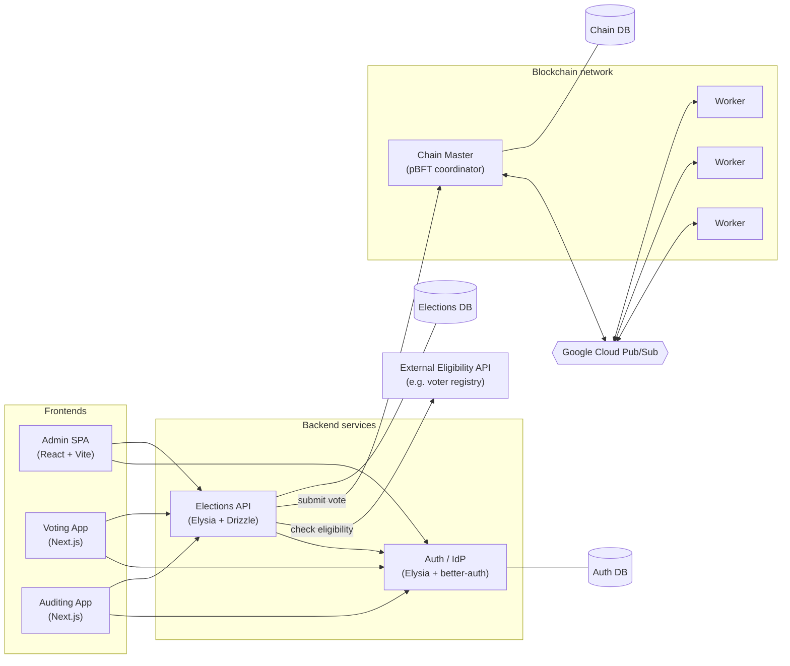

# ToraChain

A **blockchain-backed elections/voting system**, built as a Bun monorepo. Votes
are cast through a REST API, recorded on a per-election blockchain validated by a
pBFT node network, and independently auditable end to end.

> **Live demo:** https://tora-chain-demo.iansel.me · **Elections API docs:** https://api.tora-chain-demo.iansel.me/docs

## Architecture at a glance



Full write-up: **[docs/architecture.md](docs/architecture.md)**.

## Workspaces

| Workspace | Description | Docs |
| --------- | ----------- | ---- |
| [`apps/auth`](apps/auth/README.md) | Identity for voters / admins / auditors | [docs/auth.md](docs/auth.md) |
| [`apps/backend`](apps/backend/README.md) | Elections & voting REST API | [docs/backend.md](docs/backend.md) |
| [`apps/admin-fe`](apps/admin-fe/README.md) | Admin SPA (manage elections) | [docs/frontends.md](docs/frontends.md) |
| [`apps/voting-fe`](apps/voting-fe/README.md) | Voter app (enroll & cast a ballot) | [docs/frontends.md](docs/frontends.md) |
| [`apps/auditing-fe`](apps/auditing-fe/README.md) | Auditor app (verify results) | [docs/frontends.md](docs/frontends.md) |
| [`apps/torachain-cli`](apps/torachain-cli) | Blockchain node CLI (master + workers) | [docs/blockchain.md](docs/blockchain.md) |
| [`packages/*`](packages) | Shared libs: `configs`, `be-common`, `fe-common`, `ui-components`, `specs` | — |
| [`examples/simple-voters-database`](examples/simple-voters-database) | Reference eligibility-API provider | [docs/eligibility-api-specs.md](docs/eligibility-api-specs.md) |

## Deployed services

URLs are defined once in [`packages/configs/src/links.ts`](packages/configs/src/links.ts)
(`getEnv()` resolves `development` vs `demo`).

| Service | Local (dev) | Demo |
| ------- | ----------- | ---- |
| Voting app | http://voting.localhost:3001 | https://tora-chain-demo.iansel.me |
| Admin app | http://admin.localhost:3000 | https://admin.tora-chain-demo.iansel.me |
| Auditing app | http://auditing.localhost:3002 | https://auditing.tora-chain-demo.iansel.me |
| Identity provider | http://idp.localhost:8001 | https://idp.tora-chain-demo.iansel.me |
| Elections API | http://api.localhost:8000 | https://api.tora-chain-demo.iansel.me |
| Chain viewer | http://localhost:7100 | https://node.tora-chain-demo.iansel.me |

## Quick start

Run the whole stack (all apps **and** databases) with Docker — no Bun install
needed:

```bash
docker compose -f docker-compose.demo.yaml up --build
# open http://localhost:5173  →  register an admin at /admins/register
```

Full instructions, including running services natively for development, are in
**[docs/setup.md](docs/setup.md)**.

## Documentation

| Doc | Contents |
| --- | -------- |
| [Setup](docs/setup.md) | Run everything locally with Docker Compose |
| [Architecture](docs/architecture.md) | System design, request/vote flow, module map |
| [ERD](docs/erd.md) | Data model & entity relationships |
| [Tech stack](docs/tech-stack.md) | Technologies used and why |
| [Infrastructure](docs/infrastructure.md) | IaC, GCP deployment, CI/CD |
| [Auth](docs/auth.md) · [Backend](docs/backend.md) · [Frontends](docs/frontends.md) · [Blockchain](docs/blockchain.md) | Per-module deep dives |

Contributor guide and repo conventions live in [AGENTS.md](AGENTS.md).
