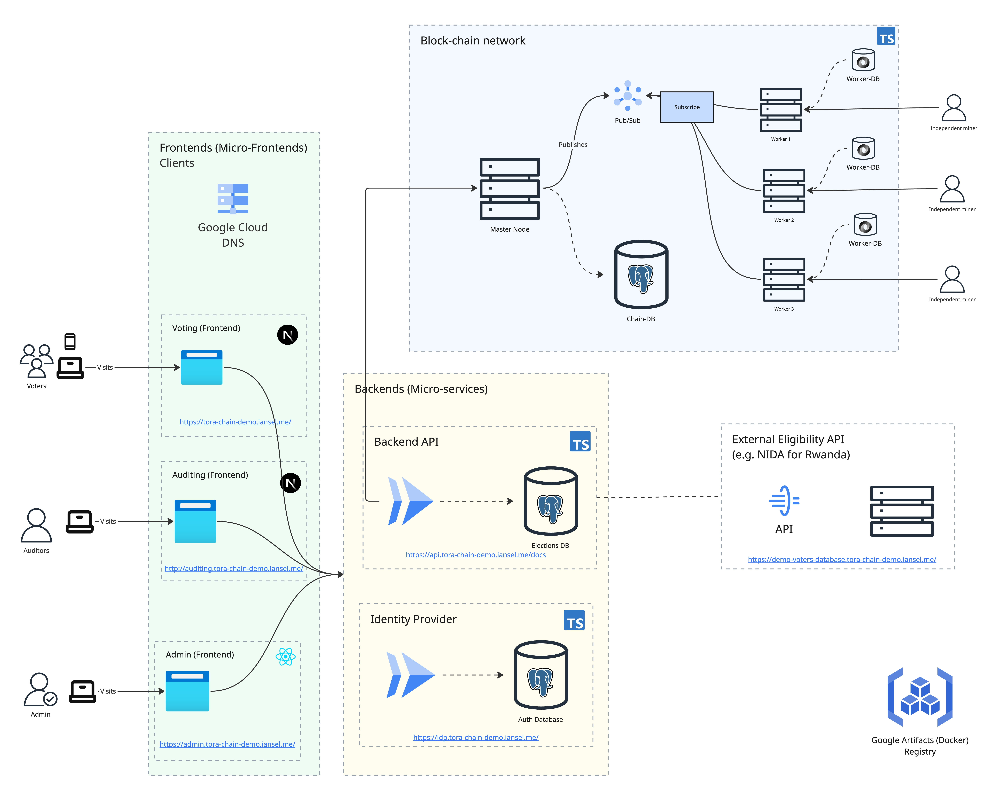

# ToraChain

[](https://github.com/irumvanselme/ToraChain/actions/workflows/main.yaml)
[](https://github.com/irumvanselme/ToraChain/actions/workflows/backend-ci.yaml)
[](https://github.com/irumvanselme/ToraChain/actions/workflows/deploy.yaml)

A **blockchain-backed elections/voting system**, built as a Bun monorepo. Votes
are cast through a REST API, recorded on a per-election blockchain replicated
over a publisher/subscriber node network, and independently auditable end to
end.

> **Live demo:** https://tora-chain-demo.iansel.me · **Elections API docs:** https://api.tora-chain-demo.iansel.me/docs

## Video

[Video](https://drive.google.com/file/d/1NIr9bJ7WzyV_cZHkMz1k5c1vKsO8iFoC/view?usp=sharing)

## Architecture at a glance



Full write-up: **[docs/architecture.md](docs/architecture.md)**.

## Workspaces

| Workspace                                                            | Description                                                                | Docs                                                           |
| -------------------------------------------------------------------- | -------------------------------------------------------------------------- | -------------------------------------------------------------- |
| [`apps/auth`](apps/auth/README.md)                                   | Identity for voters / admins / auditors                                    | [docs/auth.md](docs/auth.md)                                   |
| [`apps/backend`](apps/backend/README.md)                             | Elections & voting REST API                                                | [docs/backend.md](docs/backend.md)                             |
| [`apps/admin-fe`](apps/admin-fe/README.md)                           | Admin SPA (manage elections)                                               | [docs/frontends.md](docs/frontends.md)                         |
| [`apps/voting-fe`](apps/voting-fe/README.md)                         | Voter app (enroll & cast a ballot)                                         | [docs/frontends.md](docs/frontends.md)                         |
| [`apps/auditing-fe`](apps/auditing-fe/README.md)                     | Auditor app (verify results)                                               | [docs/frontends.md](docs/frontends.md)                         |
| [`apps/torachain-cli`](apps/torachain-cli/README.md)                 | Blockchain node CLI (master + workers)                                     | [docs/blockchain.md](docs/blockchain.md)                       |
| [`packages/*`](packages)                                             | Shared libs: `configs`, `be-common`, `fe-common`, `ui-components`, `specs` | —                                                              |
| [`examples/simple-voters-database`](examples/simple-voters-database) | Reference eligibility-API provider                                         | [docs/eligibility-api-specs.md](docs/eligibility-api-specs.md) |
| [`iac`](iac)                                                         | Infrastructure as Code (Terraform, Docker, deploy scripts)                 | [docs/infrastructure.md](docs/infrastructure.md)               |
| [`assets`](assets)                                                   | Common assets (logos, shared imagery)                                      | —                                                              |

## Testing strategy

An elections system lives or dies on trust, so every workspace is tested and
the full gate runs in CI on every push. Full guidelines, commands, and
analysis: **[docs/testing-guidelines-and-strategy.md](docs/testing-guidelines-and-strategy.md)**.

| Layer                                    | What it proves                                                        | Status (2026-07-07)                     |
| ---------------------------------------- | --------------------------------------------------------------------- | --------------------------------------- |
| **Unit** (Vitest, co-located)            | Each module in isolation — services, controllers, hashing, components | **851 tests / 111 files — all passing** |
| **Integration** (Vitest + real Postgres) | Backend HTTP API end to end, migrations rebuilt from zero             | **14 tests / 4 files — all passing**    |
| **Manual acceptance**                    | Full multi-actor election lifecycle on the deployed demo              | 7-stage script, run before each release |
| **E2E** _(planned)_                      | Browser flows against the Docker demo stack                           | Playwright, next iteration              |

Key strategies, and how they help us fix problems fast:

- **In-memory fakes + dependency injection** — controller tests drive the
  real Elysia HTTP pipeline with only the database faked, so a failure names
  the exact layer (route, service, or repository) at fault.
- **Edge cases & varied inputs** — deterministic clocks for election
  open/close windows, `test.each` tables from a `bigint` to 1 MB of data,
  duplicate-vote (`409 ALREADY_VOTED`) and tampered-block rejection paths.
- **Snapshot-guarded hashing** — any change to block hashing breaks a
  snapshot before it can desynchronise master and worker nodes in production.
- **Cross-environment runs** — macOS dev machines, Ubuntu CI runners, and the
  Linux Docker demo stack all execute the same suites; CI must be green
  before `main` can deploy.

Run it yourself: `make test` (or `make ci` for the full format → types → lint
→ test gate).

## Deployed services

URLs are defined once in [`packages/configs/src/links.ts`](packages/configs/src/links.ts)
(`getEnv()` resolves `development` vs `demo`).

| Service           | Local (dev)                    | Demo                                       |
| ----------------- | ------------------------------ | ------------------------------------------ |
| Voting app        | http://voting.localhost:3001   | https://tora-chain-demo.iansel.me          |
| Admin app         | http://admin.localhost:3000    | https://admin.tora-chain-demo.iansel.me    |
| Auditing app      | http://auditing.localhost:3002 | https://auditing.tora-chain-demo.iansel.me |
| Identity provider | http://idp.localhost:8001      | https://idp.tora-chain-demo.iansel.me      |
| Elections API     | http://api.localhost:8000      | https://api.tora-chain-demo.iansel.me      |
| Chain viewer      | http://localhost:7100          | https://node.tora-chain-demo.iansel.me     |

## Quick start

Run the whole stack with Docker — every app, both databases, the Pub/Sub
emulator, and a 4-node blockchain network. No Bun install needed:

```bash
docker compose -f docker-compose.demo.yaml up --build
```

Then open (use Chrome or Firefox — the apps live on `*.localhost` subdomains):

| Open                           | To                                                           |
| ------------------------------ | ------------------------------------------------------------ |
| http://admin.localhost:3000    | manage elections — sign in with the **Default login** button |
| http://voting.localhost:3001   | register as a voter, enroll, and cast a ballot               |
| http://auditing.localhost:3002 | register as an auditor and verify results                    |
| http://localhost:7100          | watch blocks land on the chain                               |

A demo admin (`admin@localhost.dev` / `Pa$$w0rd!`) is created automatically on
boot. Full instructions — including native (hot-reload) development — are in
**[docs/setup.md](docs/setup.md)**.

## Documentation

| Doc                                                                                                                   | Contents                                     |
| --------------------------------------------------------------------------------------------------------------------- | -------------------------------------------- |
| [Setup](docs/setup.md)                                                                                                | Run everything locally with Docker Compose   |
| [Architecture](docs/architecture.md)                                                                                  | System design, request/vote flow, module map |
| [ERD](docs/erd.md)                                                                                                    | Data model & entity relationships            |
| [Tech stack](docs/tech-stack.md)                                                                                      | Technologies used and why                    |
| [Testing](docs/testing-guidelines-and-strategy.md)                                                                    | Testing strategy, guidelines & results       |
| [Infrastructure](docs/infrastructure.md)                                                                              | IaC, GCP deployment, CI/CD                   |
| [Auth](docs/auth.md) · [Backend](docs/backend.md) · [Frontends](docs/frontends.md) · [Blockchain](docs/blockchain.md) | Per-module deep dives                        |
