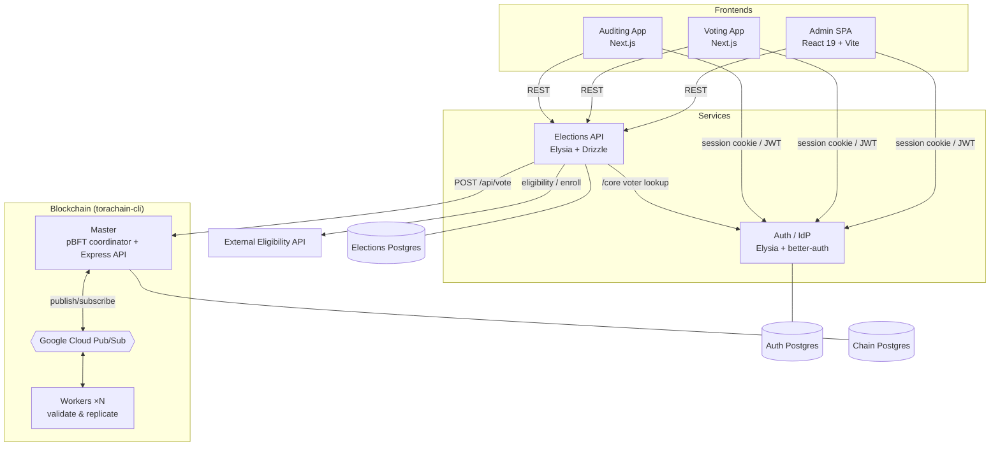
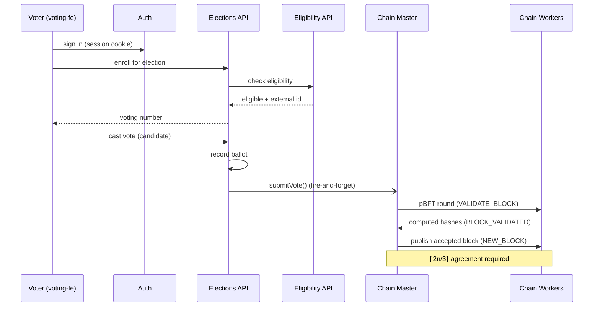

# System Architecture

ToraChain separates **identity**, **election data**, and **vote integrity** into
independent services so each can be scaled, deployed, and audited on its own.

- **Auth service** — the single identity provider for three user domains.
- **Elections API** — the system of record for elections, candidates, and ballots.
- **Blockchain network** — an append-only, independently verifiable ledger of votes.
- **Frontends** — role-specific apps for admins, voters, and auditors.

## Component diagram

## Voting flow

## Design decisions

| Choice                                           | Why                                                                                                                                                                                                    |
| ------------------------------------------------ | ------------------------------------------------------------------------------------------------------------------------------------------------------------------------------------------------------ |
| **Separate auth service, 3 identity domains**    | Voters, admins, and auditors have different lifecycles and trust levels; table-prefix isolation keeps them independent while sharing one database and one codebase.                                    |
| **Fire-and-forget vote submission to the chain** | The ballot is recorded synchronously in Postgres; chain replication is asynchronous so voter latency never depends on consensus. A `Null` chain client keeps tests and chain-less deployments working. |
| **Per-election blockchain**                      | Each election is an isolated chain with its own genesis block, so one election's load or history never affects another.                                                                                |
| **pBFT over Pub/Sub**                            | Byzantine fault tolerance gives auditable integrity without proof-of-work cost; Pub/Sub decouples the master from workers so nodes can run anywhere.                                                   |
| **External eligibility API**                     | Real voter registries are owned by third parties; delegating eligibility via a documented HTTP contract keeps ToraChain registry-agnostic.                                                             |

## Where the code lives

| Concern             | Location                                              | Module doc                             |
| ------------------- | ----------------------------------------------------- | -------------------------------------- |
| Identity & sessions | `apps/auth`                                           | [auth.md](auth.md)                     |
| Elections / votes   | `apps/backend`                                        | [backend.md](backend.md)               |
| User interfaces     | `apps/admin-fe`, `apps/voting-fe`, `apps/auditing-fe` | [frontends.md](frontends.md)           |
| Consensus & ledger  | `apps/torachain-cli`                                  | [blockchain.md](blockchain.md)         |
| Data model          | Drizzle `model.ts` per module                         | [erd.md](erd.md)                       |
| Deploy / infra      | `iac/`                                                | [infrastructure.md](infrastructure.md) |
