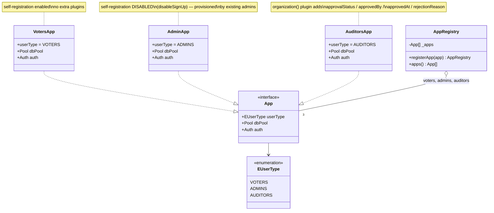
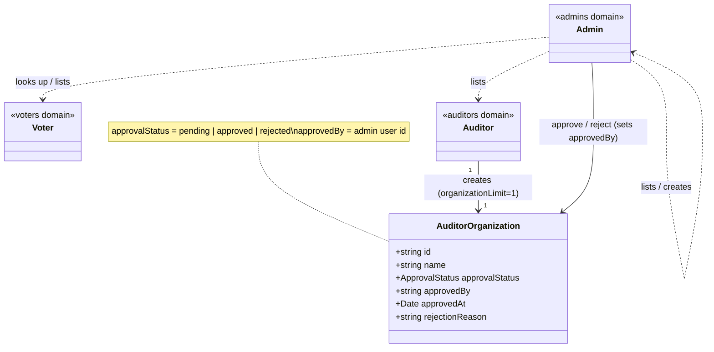

# Auth Class Diagram

Class-level view of the **auth service** (`apps/auth/app`), focused on the
relationship between the three identity domains — **admins**, **voters** and
**auditors**. Where the [auth doc](./auth.md) explains the responsibilities and
the [ERD](./erd.md) shows the persisted tables, this shows the domain objects:
how each domain is one `App` built by the shared `createAuth` factory, held by
the `AppRegistry`, and how the **admin** governs the other two.

> **Source of truth:** `apps/auth/app/types.ts`, `app/_apps.ts`,
> `app/auth/*.ts`, `app/server.ts`.

## The three domains share one factory

Each identity domain is a class implementing the `App` interface. All three are
built by the same `createAuth(userType, extraPlugins)` factory, which wires a
better-auth instance against the shared database using table-name prefixes
(`tableNames(userType)` → `voter_*`, `admin_*`, `auditor_*`). The **only**
structural difference is that `AuditorsApp` passes the `organization()` plugin
as an extra plugin, adding the approval-workflow fields.

`canSelfRegister(userType)` returns `false` only for **admins**: they cannot use
the public sign-up flow and are created by an existing admin. Voters and
auditors self-register.

## How admin, voter and auditor relate

The domains are **isolated identity stores** — no foreign keys tie a voter to an
admin. The relationships between them are *behavioural*, and they all converge
on the **admin** as the governing role:

- an **admin** lists/creates accounts in every domain;
- an **admin** looks up a **voter** by id (this is what the backend uses to
  resolve voter identities);
- an **auditor** owns one **organization** that starts `pending`, and an
  **admin** approves or rejects it.

## Notes

- The auditor approval fields (`approvalStatus`, `approvedBy`, …) live on the
  `auditor_organizations` table added by the `organization()` plugin, not on the
  auditor user — that is why the relationship is `Auditor → Organization ← Admin`.
- To add a fourth domain, add an `EUserType` value and an `*App` class and
  register it in `AuthServer`; the registry-iterating routers pick it up
  automatically.
