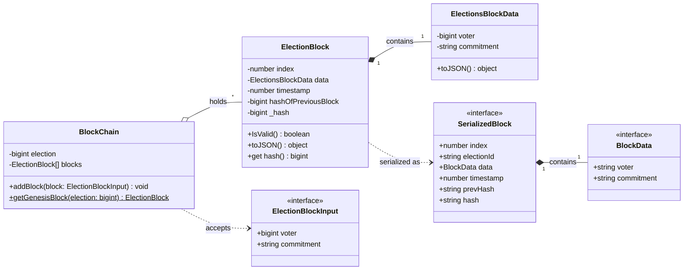

# Blockchain Class Diagram

This diagram covers the ToraChain blockchain entities in `apps/torachain-cli`:
the core in-memory chain library (`src/blockchain/`) and the persisted
wire-format shapes from `@tora-chain/specs`. Each election has its own chain
with its own genesis block.

## The `blocks` table (Postgres)

The master persists each block to the `blocks` table. The composite primary key
`(election_id, block_index)` makes inserts idempotent, so replayed Pub/Sub
messages never duplicate a block.

| Column        | Type      | Notes                                          |
| ------------- | --------- | ---------------------------------------------- |
| `election_id` | `TEXT`    | PK part 1 — one chain per election             |
| `block_index` | `INTEGER` | PK part 2 — position in that election's chain  |
| `voter_id`    | `TEXT`    | maps to `SerializedBlock.data.voter`           |
| `commitment`  | `TEXT`    | SHA-256 hex commitment to the encrypted ballot |
| `timestamp`   | `BIGINT`  | epoch millis                                   |
| `prev_hash`   | `TEXT`    | hash of the previous block (`"0"` for genesis) |
| `hash`        | `TEXT`    | this block's hash (lowercase hex)              |

## Notes

- **Two representations of a block.** The core library (`ElectionBlock` /
  `ElectionsBlockData`) uses `bigint` fields and computes hashes; the wire /
  storage format (`SerializedBlock` / `BlockData`) uses strings so master and
  workers hash the identical form. `commitment` is always a string —
  round-tripping it through `bigint` would drop leading zeros and diverge the
  hash.
- **Per-election chains.** A `BlockChain` is scoped to one `election` and seeds
  itself with a genesis block; real votes are appended via `addBlock`.
- **Tamper detection.** A worker re-hashes every received block and rejects a
  mismatch (`ElectionBlock.IsValid()`).
