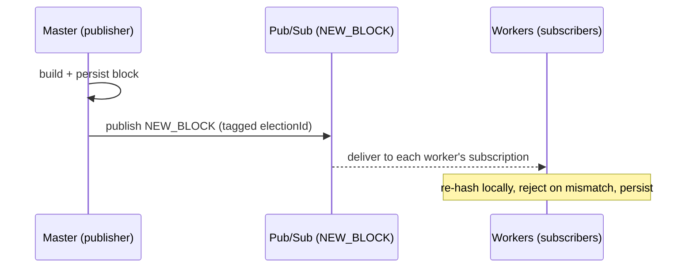

# Blockchain Network

A CLI-first, per-election blockchain that records votes on an append-only
ledger. Transport is **Google Cloud Pub/Sub**, in a simple **publisher /
subscriber** model: the master publishes committed blocks, workers subscribe
and only receive.

> **Code:** [`apps/torachain-cli`](../apps/torachain-cli) · core chain logic in
> `src/blockchain/`. Pub/Sub contracts live in
> [`packages/specs`](../packages/specs) (`TOPICS`, `newBlockFilter()`, payloads)
> — never hardcode a topic name.

## Roles

| Role        | Runs                                                                           | Does                                                                                                                                                                                               |
| ----------- | ------------------------------------------------------------------------------ | -------------------------------------------------------------------------------------------------------------------------------------------------------------------------------------------------- |
| **Master**  | Express API on `:7100` (`POST /api/vote`, `GET /api/chain`, `GET /api/status`) | On each vote, builds the next block, persists it, and **publishes** it to `NEW_BLOCK`. Persists to Postgres (`CHAIN_DB_URI`), JSON file fallback in dev.                                           |
| **Workers** | `:7101…` (anywhere)                                                            | Sync a chain over HTTP from the master, **subscribe** to `NEW_BLOCK` (filtered per election), re-hash blocks locally, reject mismatches. Store a JSON file. Pure subscribers — they never publish. |

## How a block propagates



- **Publisher / subscriber only** — there is no consensus round, quorum, or
  presence tracking. The master is the single source of truth and publishes
  every committed block; workers replicate what they receive.
- **One chain implementation** — both roles drive `BlockChain`
  (`src/blockchain/`): the master appends votes with `addBlock`, a worker takes
  in what it receives with `accept`. Blocks are only ever built, hashed and
  verified there.
- **Hashing** — goes through `ElectionBlock` so master and workers always
  agree; hashes are lowercase hex (`"0"` for genesis). A worker that computes a
  different hash for a received block rejects it.
- **Storage is injected** — a `BlockChain` is constructed with an
  `IBlockChainStorageService` (Postgres, a JSON file, memory in tests) and
  persists every block it appends. JSON is the persistence/wire format only,
  never the structure the chain logic works with.
- **Per-election chains** — each election has its own genesis block and chain.
  A worker filters its subscription to one election (or `all`).
- **Block contents** — a block records only the voter's number and the ballot
  **commitment** (SHA-256 of the voter-sealed ciphertext) — never the
  plaintext choice, so the public chain leaks nothing about how anyone voted.

## Running

```bash
make torachain-cli-network       # master (7100) + 3 workers (7101-7103)
make torachain-cli-master        # master only
PORT=7104 MASTER_URL=http://localhost:7100 ELECTION=all make torachain-cli-worker
```

Local dev needs the Pub/Sub **emulator** (`make torachain-cli-pubsub-emulator`
from the repo root, then set `PUBSUB_EMULATOR_HOST` — see
[`apps/torachain-cli/.env.example`](../apps/torachain-cli/.env.example)) —
Pub/Sub has no local fallback.

## Viewer & deployment

Both roles serve a static chain viewer at `/` (from `src/web/`), deployed at
`node.tora-chain-demo.iansel.me`. Credentials/IAM for the master and workers are
defined in `iac/terraform/pubsub.tf` — see [infrastructure.md](infrastructure.md).

CLI flags, env vars, and scripts:
[`apps/torachain-cli/README.md`](../apps/torachain-cli/README.md).
