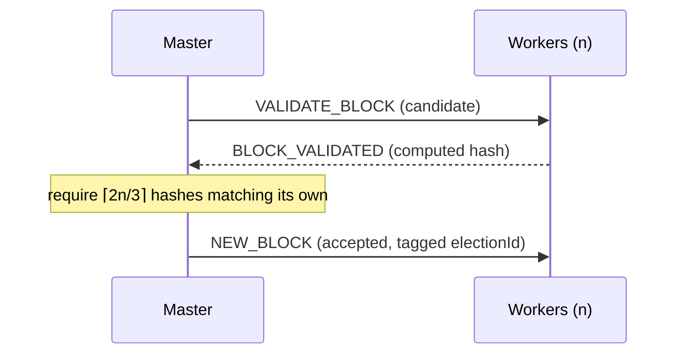

# Blockchain Network

A CLI-first, per-election blockchain that records votes on a **pBFT**-validated,
append-only ledger. Transport is **Google Cloud Pub/Sub**.

> **Code:** [`apps/torachain-cli`](../apps/torachain-cli) · core chain logic in
> `src/blockchain/`. Pub/Sub contracts live in
> [`packages/specs`](../packages/specs) (`TOPICS`, `newBlockFilter()`, payloads)
> — never hardcode a topic name.

## Roles

| Role        | Runs                                                                           | Does                                                                                                                                                                          |
| ----------- | ------------------------------------------------------------------------------ | ----------------------------------------------------------------------------------------------------------------------------------------------------------------------------- |
| **Master**  | Express API on `:7100` (`POST /api/vote`, `GET /api/chain`, `GET /api/status`) | Runs a pBFT round per vote, persists the block, publishes it to `NEW_BLOCK`. Requires ≥ 3 live subscribers. Persists to Postgres (`CHAIN_DB_URI`), JSON file fallback in dev. |
| **Workers** | `:7101…` (anywhere)                                                            | Sync a chain over HTTP from the master, subscribe to `NEW_BLOCK` (filtered per election), re-hash blocks locally, reject mismatches. Store a pretty-printed JSON file.        |

## Consensus (pBFT)



- **Presence** — workers heartbeat to `WORKER_PRESENCE` every 5s; the master
  ages out nodes after 3 missed intervals. This backs the quorum check.
- **Hashing** — goes through `ElectionBlock` (`src/chain/hash-bridge.ts`) so
  master and workers always agree; hashes are lowercase hex (`"0"` for genesis).
- **Per-election chains** — each election has its own genesis block and chain.

## Running

```bash
make torachain-cli-network       # master (7100) + 3 workers (7101-7103)
make torachain-cli-master        # master only
PORT=7104 MASTER_URL=http://localhost:7100 ELECTION=all make torachain-cli-worker
```

Local dev needs the Pub/Sub **emulator** (`make torachain-cli-pubsub-emulator`
from `iac/`, `PUBSUB_EMULATOR_HOST`) — Pub/Sub has no local fallback.

## Viewer & deployment

Both roles serve a static chain viewer at `/` (from `src/web/`), deployed at
`node.tora-chain-demo.iansel.me`. Credentials/IAM for the master and workers are
defined in `iac/terraform/pubsub.tf` — see [infrastructure.md](infrastructure.md).

Object model: [uml/classDiagram.md](uml/classDiagram.md).
