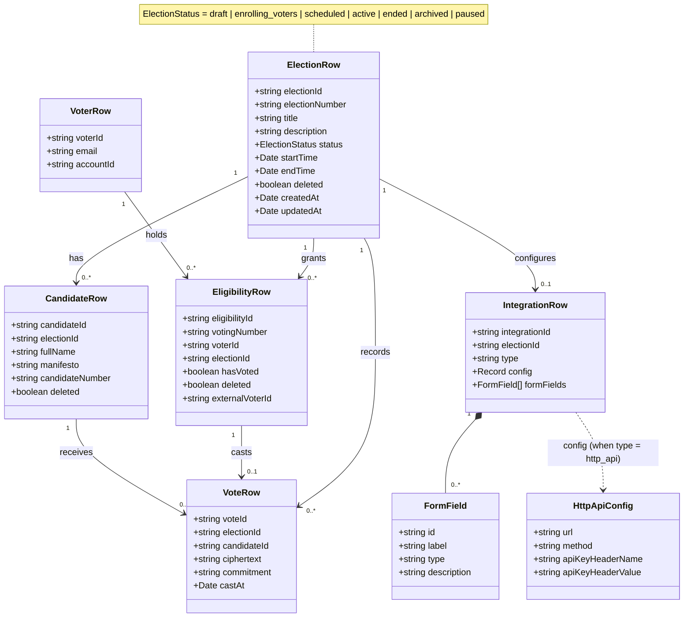
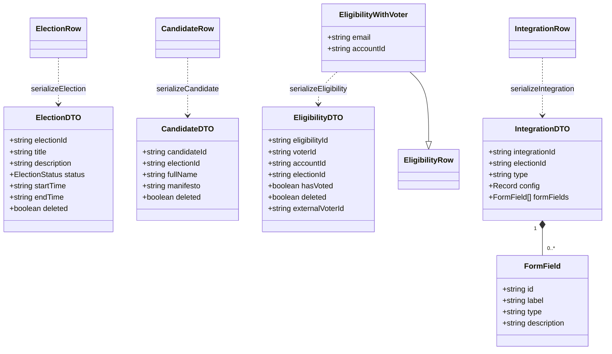

# Domain Class Diagram

Class-level view of the **elections backend** domain model
(`apps/backend/app/**/model.ts`). Where the [ERD](./erd.md) shows the persisted
tables, this shows the domain objects as classes: the entities (`*Row`), their
serialized transfer shapes (`*DTO`) and the value objects they carry, plus the
relationships between them.

Each entity is defined once in its module's `model.ts` as a Drizzle table
(`*Row`), with a `serialize*` function projecting it to a `*DTO` for the API.

## Domain entities & relationships

Associations mirror the foreign keys in the data model: an election owns its
candidates, eligibilities, votes and integration; a voter holds eligibilities;
an eligibility casts at most one vote for a candidate.

## Transfer objects (DTOs)

The API-facing projections produced by each `serialize*` function.

> The source of truth for these classes is each module's `model.ts` under
> `apps/backend/app/` (`elections`, `candidates`, `voters`, `votes`,
> `integrations`).
> </content>
