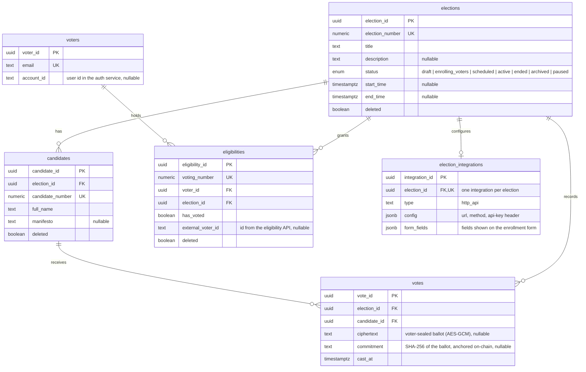
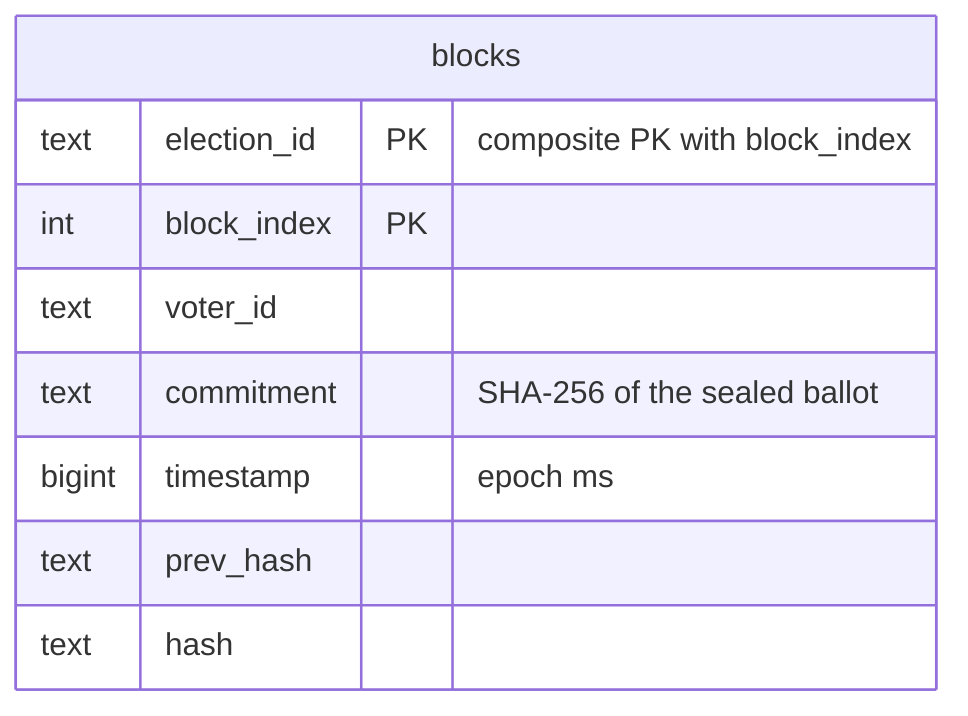

# Entity-Relationship Diagram

The data model is split across three databases, one per service, so no service
reaches into another's tables — they integrate over HTTP instead.

- **Auth DB** — better-auth tables per identity domain (`voter_*`, `admin_*`,
  `auditor_*` table prefixes): users, sessions, accounts, JWKS. Plus the
  auditor organization tables (`auditor_organizations` with approval fields,
  `auditor_members`, `auditor_invitations`) and the hashed API keys used by
  the backend to call the `/core` API.
- **Elections DB** — elections, candidates, voters, eligibilities, votes,
  integrations (below).
- **Chain DB** — blocks persisted by the master node (below).

## Elections data model

All tables also carry `created_at` / `updated_at` timestamps. The
`*_number` columns are 216-bit numeric identifiers (`numeric(78,0)`) that
double as the entities' on-chain addresses.

Notable constraints and indexes:

- `election_number`, `candidate_number`, and `voting_number` are all
  `NOT NULL` and carry a unique constraint (`numeric(78,0)`).
- `eligibilities` has a partial unique index on (`voter_id`, `election_id`)
  where `deleted = false` — a voter holds at most one live eligibility per
  election. Its `created_at`/`updated_at` are millisecond precision so keyset
  pagination cursors round-trip exactly.
- `votes` holds **no** column that resolves to a voter — no `eligibility_id`,
  no `voting_number`. Either would join back to `eligibilities.voter_id` and
  put the voter one hop from `candidate_id`, handing anyone who can read the
  database the full "who voted for whom" list. The voter's own link to their
  ballot lives outside the database, in the receipt they keep:
  `<vote_id>:<AES key>`.
- One ballot per eligibility is enforced on the `eligibilities` side, by the
  conditional `has_voted` update that shares a transaction with the vote insert.
  That flip also leaves `updated_at` untouched, so an eligibility cannot be
  matched to a vote by comparing it against `votes.cast_at`.
- Foreign keys cascade on delete: `candidates`, `eligibilities`, and `votes`
  all reference `elections(election_id)` with `ON DELETE CASCADE`; `votes` also
  cascades from `candidates`, and `eligibilities` from `voters`. Deleting a
  voter no longer removes their ballot — nothing records which one it was.
- Lookup indexes: `elections_status_idx` (`status`),
  `candidates_election_idx` (`election_id`),
  `eligibilities_election_idx` (`election_id`),
  `votes_election_idx` (`election_id`).

## Blockchain data model

The master persists every accepted block to a single `blocks` table (Postgres
via `CHAIN_DB_URI`; a JSON file in dev). Each election is its own chain:
rows sharing an `election_id`, hash-linked through `prev_hash` (`"0"` for the
genesis block). A block stores only the voter's number and the ballot
**commitment** — never the plaintext choice.

> The source of truth for tables is each module's Drizzle `model.ts`
> (`apps/backend/app/**/model.ts`), the better-auth schema in `apps/auth`,
> and `apps/torachain-cli/src/storage/pg-store.ts` for the chain.
