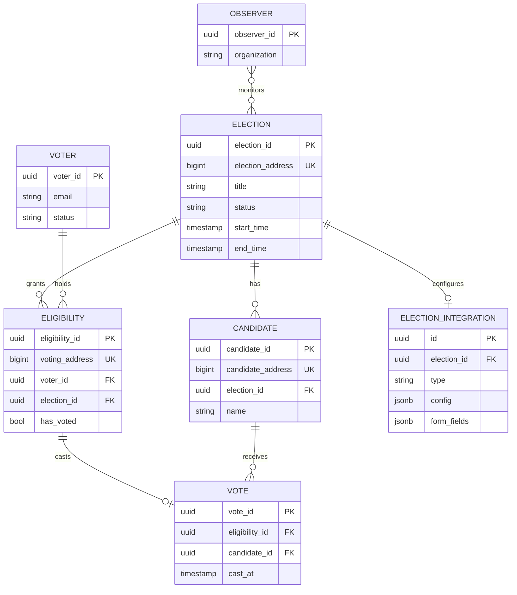
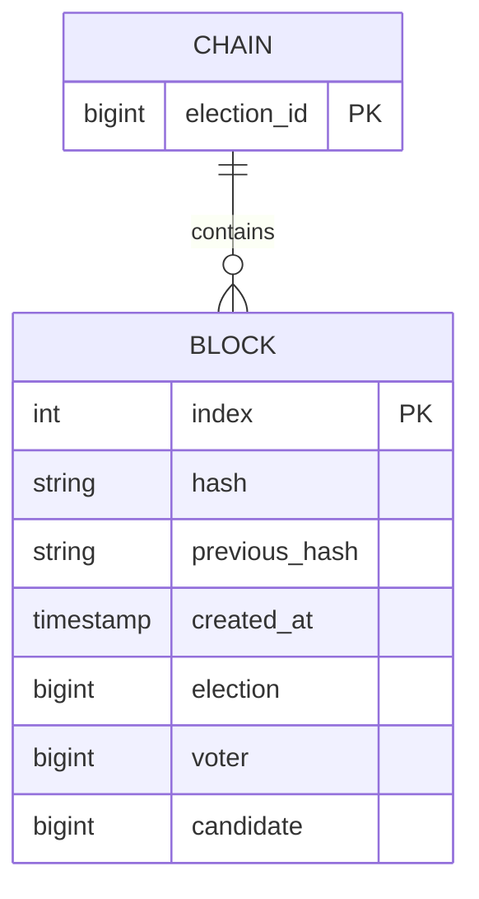

# Entity-Relationship Diagram

The data model is split across three databases, one per service, so no service
reaches into another's tables — they integrate over HTTP instead.

- **Auth DB** — users per identity domain (`voter_*`, `admin_*`, `auditor_*`
  table prefixes), sessions, JWTs, API keys, auditor organizations.
- **Elections DB** — elections, candidates, eligibility, ballots, integrations.
- **Chain DB** — persisted blocks per election (master node).

## Elections data model

## Blockchain data model

Every recorded vote becomes a block; blocks are chained by hash per election.

See [uml/classDiagram.md](uml/classDiagram.md) for the object model
(`ElectionsBlock`, `ElectionsBlockChain`) and the domain class diagram.

> The source of truth for tables is each module's Drizzle `model.ts`
> (`apps/backend/app/**/model.ts`) and the better-auth schema in `apps/auth`.
