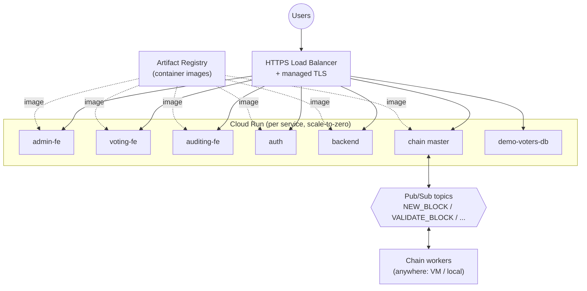

# Infrastructure & Deployment

ToraChain deploys to **Google Cloud Platform**, fully described as code with
**Terraform** in [`iac/terraform`](../iac/terraform) and containerized with the
Dockerfiles in [`iac/docker`](../iac/docker). CI/CD is GitHub Actions.

## Topology



## What Terraform manages

Files in [`iac/terraform`](../iac/terraform):

| File                                | Responsibility                                                                |
| ----------------------------------- | ----------------------------------------------------------------------------- |
| `apis.tf`                           | Enable required GCP APIs                                                      |
| `artifact_registry.tf`              | Docker image registry                                                         |
| `cloud_run.tf`                      | One Cloud Run v2 service per app (`for_each` over `locals.services`)          |
| `load_balancer.tf`                  | Global HTTPS LB + host-based routing                                          |
| `dns.tf`                            | `*.tora-chain-demo.iansel.me` records + managed certs                         |
| `pubsub.tf`                         | Chain topics/subscriptions + `chain_master` / `chain_worker` service accounts |
| `locals.tf`                         | Service catalog: image, port, subdomains, scaling, env                        |
| `variables.tf` / `terraform.tfvars` | Project id, region, image tags, secrets                                       |
| `outputs.tf`                        | Service URLs, worker SA for key generation                                    |

Each service maps to a subdomain of `tora-chain-demo.iansel.me` (`admin`,
`voting`/root, `auditing`, `idp`, `api`, `node`) via the load balancer's
host rules, derived automatically from `locals.tf`.

### Key design points

- **Scale to zero** (`min_instances = 0`) keeps idle demo cost near nothing;
  CPU bursts during requests (`cpu_idle = true`).
- **Single chain master** (`max_instances = 1`) because pBFT needs exactly one
  coordinator; **workers run outside Cloud Run** and join via Pub/Sub with a
  `chain_worker` service-account key.
- **Secrets are injected per service** as Cloud Run env vars from Terraform
  variables (`BETTER_AUTH_SECRET`, `*_DB_URI`, `ELIGIBILITY_API_KEY`), never
  committed.
- **Databases** use external managed Postgres connection strings passed in as
  secrets (`AUTH_DB_URI`, `ELECTIONS_DB_URI`, `CHAIN_DB_URI`).

## CI/CD

- **CI** — [`.github/workflows/main.yaml`](../.github/workflows) runs on push to
  any branch and fans out to reusable per-workspace workflows (`auth-ci`,
  `backend-ci` with unit + integration jobs, and one per frontend). Each gate is
  `format:check → check-types → lint → test` (+ `build` for frontends).
  `make ci` reproduces it locally.
- **CD** — on `main`, `deploy.yaml` builds and pushes images to Artifact
  Registry, then applies Terraform to roll out Cloud Run.

## Deployment plan (reproduce it)

The [`iac/Makefile`](../iac/Makefile) drives the whole flow (CD runs the same
steps via `deploy.yaml`):

```bash
cd iac/terraform
cp terraform.tfvars.example terraform.tfvars   # fill project_id, region, secrets
cd ..

make init         # terraform init (once, or after provider changes)
make bootstrap    # [1] Artifact Registry + DNS zone
make nameservers  # [2] print the NS record to delegate at your DNS host
make build-push   # [3] build & push all images (iac/docker/*.Dockerfile)
make apply        # [4] Cloud Run + load balancer + DNS records + TLS cert
```

Then run chain workers (outside GCP) against the deployed master:

```bash
GOOGLE_APPLICATION_CREDENTIALS=worker-key.json \
  ./apps/torachain-cli/start \
  --master-url https://node.tora-chain-demo.iansel.me --election <id>
```

Generate a worker key from the `chain_worker_service_account` Terraform output
with `gcloud iam service-accounts keys create` — never commit it.

See [blockchain.md](blockchain.md) for how the chain network operates and
[setup.md](setup.md) to run the whole stack locally instead.
