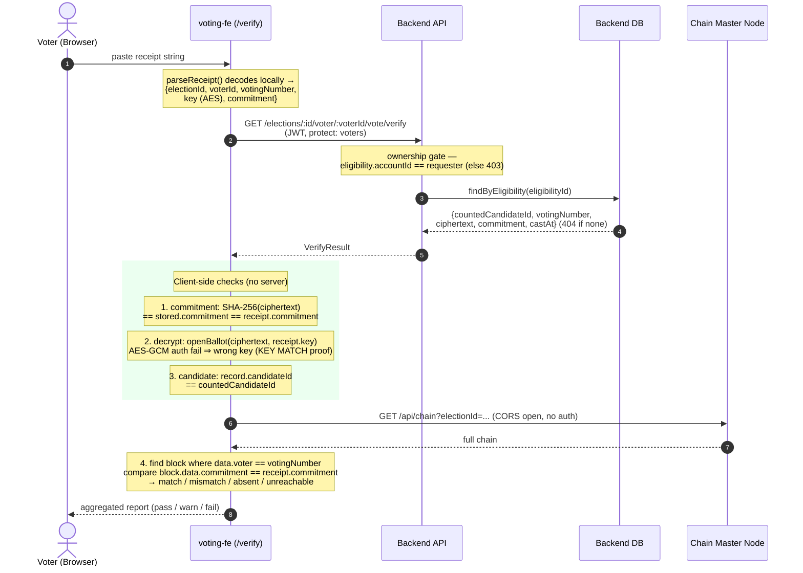

# ToraChain — Sequence Diagrams

Sequence diagrams for the three core voter-facing flows. Rendered with
[Mermaid](https://mermaid.js.org/). Endpoint paths, auth requirements, and the
data anchored on-chain reflect the actual implementation in `apps/backend`,
`apps/auth`, `apps/voting-fe`, `apps/torachain-cli`, and the reference
eligibility provider in `examples/simple-voters-database`.

---

## 1. Voter Registration

Two distinct records exist for a voter: a **login account** in the auth service
(`voter_*` tables, better-auth) and a separate **voter/eligibility record** in
the backend, linked by `accountId`. Registration therefore has two parts:
account sign-up (identity) and per-election enrollment (eligibility), the latter
delegating to an external eligibility provider over HTTP.

```mermaid
sequenceDiagram
    autonumber
    actor V as Voter (Browser)
    participant FE as voting-fe
    participant AUTH as Auth Service<br/>(/voters/api)
    participant ADB as Auth DB
    participant BE as Backend API
    participant EXT as Eligibility Provider<br/>(external HTTP API)
    participant BDB as Backend DB

    rect rgb(235, 245, 255)
    note over V, ADB: (a) Account sign-up (self-registration)
    V->>AUTH: GET /voters/register
    AUTH-->>V: rendered form (name, email, password)
    V->>AUTH: POST /voters/api/sign-up/email<br/>{name, email, password}
    AUTH->>ADB: INSERT voter_users / voter_account
    ADB-->>AUTH: created
    AUTH-->>V: 200 + session cookie (SameSite=None; Secure)
    note over V: redirect to /voters/login
    V->>AUTH: POST /voters/api/token (session cookie)
    AUTH-->>V: voter JWT (bearer for backend calls)
    end

    rect rgb(235, 255, 240)
    note over V, BDB: (b) Enrollment / eligibility for an election
    V->>BE: GET /elections/:id/integration (JWT)
    BE-->>V: integration config + formFields (or 404)
    V->>BE: POST /elections/:id/eligibility-check<br/>{voterAccountId, fields} (JWT)
    BE->>EXT: POST {config.url}<br/>{election-id, voter-account-id, ...fields}<br/>x-api-key header
    EXT-->>BE: 200 {id} eligible / 400 {message}
    BE-->>V: {eligible, externalVoterId?, reason?}
    V->>BE: POST /elections/:id/enroll<br/>{voterAccountId, email, fields} (JWT)
    BE->>EXT: POST {config.url} (re-verify to prevent forgery)
    EXT-->>BE: 200 {id}
    BE->>BDB: find-or-create voter (accountId)<br/>create eligibility (votingNumber, externalVoterId)
    BDB-->>BE: eligibility row
    BE-->>V: 201 {voterId, votingNumber, ...}
    end
```

**Notes**

- `canSelfRegister` is true for the `voters` domain, so sign-up is open;
  cookies are cross-site (`SameSite=None; Secure`) for SPA support.
- `votingNumber` is a 216-bit crypto-random decimal generated server-side at
  enrollment (`generateBigNumber()`), stored as `numeric(78,0)`.
- Enrollment **re-runs** the eligibility check against the external provider so
  a client cannot forge an "eligible" result. Not eligible → `403 NOT_ELIGIBLE`;
  already enrolled → `409 ALREADY_ELIGIBLE`.
- Alternative path (not shown): an admin grants eligibility directly via
  `POST /elections/:id/voters`, resolving identity through the auth core API
  `GET /core/api/voters/:voterUserId` (`x-api-key`).

---

## 2. Vote Casting

The plaintext candidate is **encrypted in the browser** (AES-256-GCM); only the
`ciphertext` and its SHA-256 `commitment` reach the server. The commitment —
never the candidate — is what gets anchored on the blockchain. Chain submission
is **fire-and-forget**, so a chain outage never blocks a vote.

```mermaid
sequenceDiagram
    autonumber
    actor V as Voter (Browser)
    participant FE as voting-fe
    participant BE as Backend API
    participant BDB as Backend DB
    participant CN as Chain Master Node
    participant PS as Pub/Sub<br/>(NEW_BLOCK topic)
    participant W as Chain Worker(s)

    note over V: sealBallot() — encrypt locally<br/>ciphertext = AES-GCM(candidate)<br/>commitment = SHA-256(ciphertext)<br/>AES key kept in receipt, never sent

    V->>BE: POST /elections/:id/voter/:voterId/vote<br/>{candidateId, ciphertext, commitment} (JWT, protect: voters)

    rect rgb(255, 248, 235)
    note over BE, BDB: Validation + eligibility (VotesService.cast)
    BE->>BDB: load election, eligibility, candidate
    BDB-->>BE: rows
    note over BE: guards — NOT_ELIGIBLE (403),<br/>ELECTION_NOT_OPEN (409),<br/>ALREADY_VOTED (409),<br/>CANDIDATE_NOT_IN_ELECTION (422)
    note over BE: re-derive sha256Hex(ciphertext)<br/>must equal client commitment (else 400)
    end

    BE->>BDB: TX: UPDATE eligibilities SET has_voted=true<br/>(atomic; 0 rows → 409 ALREADY_VOTED)<br/>INSERT INTO votes (...)
    BDB-->>BE: castAt

    BE-)CN: POST /api/vote (fire-and-forget)<br/>{electionId, votingNumber, commitment}
    BE-->>V: 201 {accepted, votingNumber, castAt}

    rect rgb(240, 240, 255)
    note over CN, W: Chain side (async, decoupled from the voter)
    CN->>CN: enqueue commit → build next block<br/>hash(index, voter, commitment, ts, prevHash)
    CN->>CN: store.append(block)
    CN-)PS: publish block (attr electionId)
    PS-)W: deliver block (filtered by electionId)
    W->>W: re-hash locally; reject on mismatch
    end
```

**Notes**

- Body: `{candidateId, ciphertext?, commitment?}` — `ciphertext` and
  `commitment` must be supplied together. The server trusts only its own
  re-derived `sha256Hex(ciphertext)`.
- The double-vote guard is an atomic conditional `UPDATE` inside the same
  transaction as the `INSERT`; the `votes` table also has a unique constraint on
  `eligibility_id`.
- On-chain block `data = { voter: <votingNumber>, commitment }` — no candidate,
  no plaintext ever leaves the encrypted receipt.
- `HttpChainNodeClient.submitVote` swallows all errors (`.catch()`); when
  `CHAIN_NODE_URL` is unset a `NullChainNodeClient` no-op is used instead.
- Workers are pure subscribers: they sync the chain over HTTP on startup, then
  only receive and re-hash blocks — they never publish back.

---

## 3. Vote Verification (with verification key)

The "verification key" is the **AES-256-GCM key** embedded in the voter's
receipt string; it never touches the server. Verification is a **client-side**
process: one authenticated backend read, local decryption (a successful decrypt
_is_ the key-match proof), and an **independent** blockchain cross-check that
deliberately bypasses the backend so a dishonest backend cannot fake the anchor.



**Notes**

- There is no "submit key, get yes/no" endpoint. The backend never sees the AES
  key and never hash-compares it; the successful AES-GCM decryption in the
  browser is the key-match step.
- The verify endpoint is gated to the owning account (`403 FORBIDDEN`
  otherwise), so a leaked voting number alone cannot read someone else's vote.
- The blockchain read goes **directly** from the browser to the chain node
  (`GET /api/chain`, CORS `*`), independent of the backend, so the anchor
  cross-check is trustworthy even if the backend lies.
- If the vote was recorded without an encrypted receipt (`ciphertext`/
  `commitment` null), verification reports "recorded but cannot be
  cryptographically verified."
- The receipt-based verify flow lives entirely in **voting-fe**; auditing-fe
  does not perform receipt-key verification.
