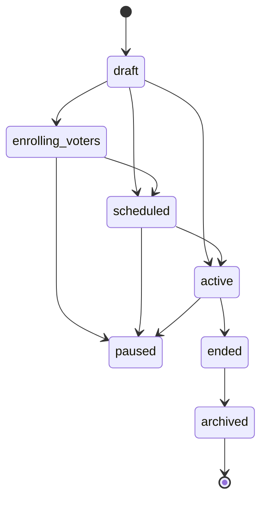
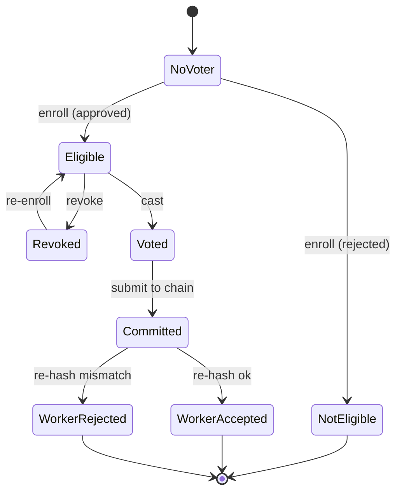

# ToraChain State Diagrams

State-machine diagrams for the two core lifecycles in ToraChain.

- [Election Lifecycle](#election-lifecycle)
- [Vote Lifecycle](#vote-lifecycle)

---

## Election Lifecycle

Admin-driven `status` machine (`elections/model.ts`, transitions in
`elections/utils.ts`). `paused` has no defined exit; `archived` is terminal.

---

## Vote Lifecycle

From voter enrollment, through ballot casting, to on-chain anchoring
(`integrations/`, `votes/`, `torachain-cli`).

