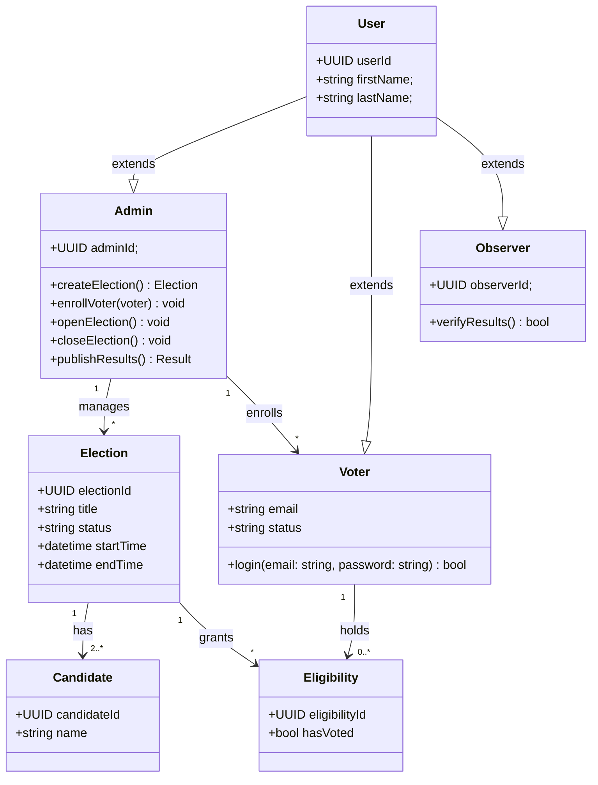
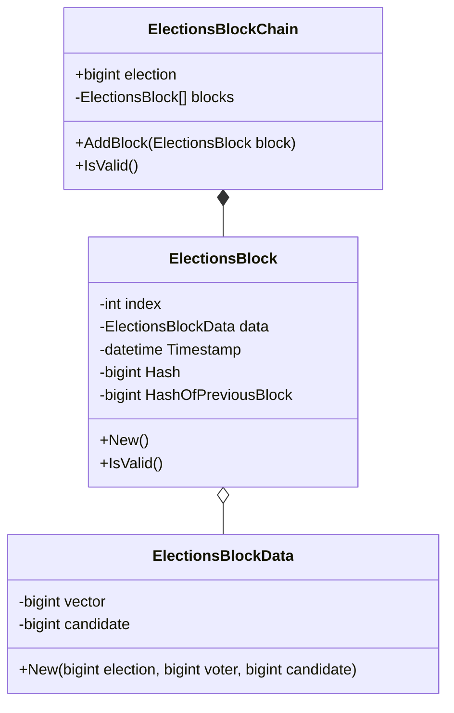

```mermaid
classDiagram
    class User {
        +UUID userId
        +string firstName;
        +string lastName;
    }

    class Admin {
        +UUID adminId;
        +createElection() Election
        +enrollVoter(voter) void
        +openElection() void
        +closeElection() void
        +publishResults() Result
    }

    class Candidate {
        +UUID candidateId
        +string name
    }

    class Observer {
        +UUID observerId;
        +verifyResults() bool
    }

    class Election {
        +UUID electionId
        +string title
        +string status
        +datetime startTime
        +datetime endTime
    }

    class Voter {
        +string email
        +string status
        +login(email: string, password: string) bool
    }

    class Eligibility {
        +UUID eligibilityId
        +bool hasVoted
    }

    User --|> Admin: extends
    User --|> Voter: extends
    User --|> Observer: extends

    Admin "1" --> "*" Election : manages
    Admin "1" --> "*" Voter : enrolls
    Election "1" --> "2..*" Candidate : has
    Election "1" --> "*" Eligibility : grants
    Voter "1" --> "0..*" Eligibility : holds
```

```mermaid
classDiagram
    class ElectionsBlockData {
        -bigint vector
        -bigint candidate
        +New(bigint election, bigint voter, bigint candidate)
    }

    class ElectionsBlock {
        -int index
        -ElectionsBlockData data
        -datetime Timestamp
        -bigint Hash
        -bigint HashOfPreviousBlock

        +New()
        +IsValid()
    }

    class ElectionsBlockChain {
        +bigint election
        -ElectionsBlock[] blocks
        +AddBlock(ElectionsBlock block)
        +IsValid()
    }

    ElectionsBlock o-- ElectionsBlockData
    ElectionsBlockChain *-- ElectionsBlock
```
