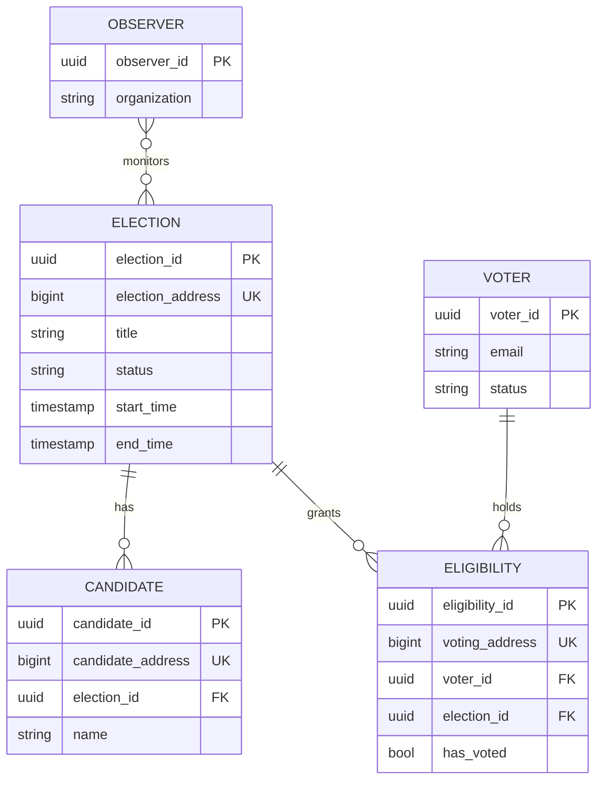

```mermaid
erDiagram
    ELECTION ||--o{ CANDIDATE : has
    ELECTION ||--o{ ELIGIBILITY : grants
    VOTER ||--o{ ELIGIBILITY : holds
    OBSERVER }o--o{ ELECTION : monitors

    ELECTION {
        uuid election_id PK
        bigint election_address UK
        string title
        string status
        timestamp start_time
        timestamp end_time
    }
    CANDIDATE {
        uuid candidate_id PK
        bigint candidate_address UK
        uuid election_id FK
        string name
    }
    VOTER {
        uuid voter_id PK
        string email
        string status
    }
    ELIGIBILITY {
        uuid eligibility_id PK
        bigint voting_address UK
        uuid voter_id FK
        uuid election_id FK
        bool has_voted
    }
    OBSERVER {
        uuid observer_id PK
        string organization
    }
```
